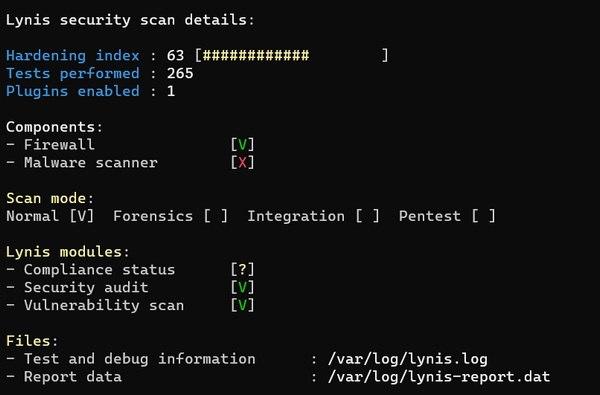

## Guide d’installation et configuration – Audit Linux, Audit Active Directory et Audit Serveurs Windows

## Sommaire
### 1) Guide d’installation et configuration Audit Linux – Lynis, Open Scape
a. [Installation et configuration de l'outil **Lynis**](#lynis)

b. [Installation et configuration de l'outil **OpenScap**](#openscap)


### 2) Guide d’installation et configuration Active Directory – Ping Castle

a. [Installation et configuration de l'outil **Ping Castle**](#pingcastle)

b. [Installation et configuration de l'outil **Microsoft ToolKit**](#toolkit)

c. [Installation et configuration de l'outil **HardenSysvol**](#harden)

### 3) Guide d’installation et configuration Audit Serveur Windows – AccessChk, AccessEnum, ShareEnum

a. [Installation et confiugration de l'ouil **AccessChk**](#Chk)

b. [Installation et configuration de l'outil **AccessEnum**](Access)

c. [Installation et configuration de l'outil **ShareEnum**](#Share)


## 1) Guide d’installation et configuration Audit Linux – Lynis, Open Scape  

### a - Installation et configuration de l'outil **Lynis**
<span id="lynis"/><span> 

Lynis est un utilitaire en ligne de commande qui va permettre d'analyser la configuration d'une machine Linux (ici nous allons l'utiliser sur un serveur Débian hébergeant notre service mail). Cela va nous permettre d'avoir un apercu de la sécurité de notre serveur. 

Pour l'installer il suffit de taper ceci :
```bash
sudo apt-get update 
sudo apt-get install lynis -y
```

Pour être sur que l'utilitaire est sur notre machine, nous pouvons vérifier en tapant : 
```bash
lynis update info
```


Maintenant nous allons utiliser Lydis pour faire un audit de notre système pour voir ce qui est bien configurer et ce qui peut être amélioé : 
```bash
sudo lynis audit system
```

Au premier audit nous avons un score de **63**. Plus le score est haut et mieux la machine est sécurisée. 



Lydis nous a pointer que SSHD n'est pas sécurisé (en effet, tout est par défaut). Nous allons modifier le fichier comme suit :
```bash
nano /etc/ssh/sshd_config
```


Puis nous allons relancer le service sshd
```bash
systemctl restart sshd
```

Maintenant quand nous refaisons un audit, notre score a augmenté !


Pour encore améliorer la configuration du système, nous allons télécharger plusieurs paquets reccomander par Lynis : 
```bash
#Clamav est un antivirus.
#unattend-upgrades va vous permettre de gérer vos mises à jour en automatique et même de reboot la machine ou de purger automatiquement les anciens packages , il est entièrement configurable.
#rkhunter est un anti-rootkit qui va analyser votre système de fichier.
#Fail2ban, lui va se baser sur vos fichiers de logs en fonction de ce que vous lui donner à lire et il va travailler avec iptables, par exemple pour bannir les adresses IP qui tentent de "brute forcer" votre serveur en SSH.
sudo apt-get install debsums apt-listbugs needrestart apt-show-versions fail2ban unattended-upgrades clamav clamav-daemon rkhunter
```

Grâce a cela notre sécurité augmente de nouveau 


b. Installation et configuration de l'outil **OpenScap**
<span id="openscap"/><span> 


## 2) Guide d’installation et configuration Active Directory – Ping Castle

### a. Installation et configuration de l'outil **Ping Castle**
<span id="pingcastle"/><span> 

## Présentation de Ping Castle

Ping Castle est un logiciel français gratuit pour auditer votre propre annuaire Active Directory. Il génère un score de risque et un rapport détaillé pour améliorer la sécurité de votre AD.  

**Prérequis :**  

- Un compte sur le domaine cible (pas nécessairement administrateur)  
- Compatible de Windows 7 à Windows 11 et Windows Server 2008 à 2022  
- Licence gratuite pour audit interne, licence payante pour prestations commerciales  

## Étapes d'installation  

### 1. Téléchargement  

- Accédez au site officiel de Ping Castle  
- Cliquez sur "Download" dans le menu  
- Téléchargez l'archive ZIP contenant les sources  
- Extrayez le contenu dans un répertoire (recommandé : directement sur le contrôleur de domaine pour un audit plus rapide)  

### 2. Structure des fichiers  

Après extraction, vous obtiendrez :  

- `PingCastle.exe` : Exécutable principal  
- `PingCastle.exe.config` : Fichier de configuration  
- Deux documents PDF de documentation  
### 3. Configuration SMTP (optionnel)  

Pour l'envoi automatique de rapports par email, configurez le serveur SMTP dans le fichier `PingCastle.exe.config`.  

### b. Installation et configuration de l'outil **Microsoft ToolKit**
<span id="toolkit"/><span> 


### c. Installation et configuration de l'outil **HardenSysvol**
<span id="harden"/><span> 
  
Harden-Sysvol est un module PowerShell qui audite la stratégie de groupe et analyse le contenu des fichiers du dossier SYSVOL afin de détecter les données sensibles, les erreurs de configuration ou les éléments suspects tels que les fichiers cachés, les macros malveillantes, les listes de contrôle d'accès incorrectes, etc. Il prend en charge plusieurs types et extensions de fichiers, notamment les documents Office, les PDF, les formats LibreOffice et OpenOffice.  
    

Avec une seule commande, Invoke-Hardensysvolvous aide à identifier les risques de sécurité potentiels et les erreurs de configuration qui passent souvent inaperçus.  
  
🔧 Principales caractéristiques  
🔍 Analyse les données sensibles (mots de passe, informations d'identification, hachages, adresses IP, etc.) sur plus de 40 extensions de fichiers.  
  
🛡 Analyse les binaires suspects (EXE renommés, DLL, installateurs MSI) parmi plus de 180 types connus  
  
🎫 Vérifie les certificats/clés privées exportables (PFX, CER, PEM…) et signale ceux qui ne sont pas sécurisés  
  
🖼 Détecte les fichiers cachés dans les images (ZIP, EXE…) en utilisant des techniques de stéganographie  
  
📂 Audite les ACL sur les fichiers et dossiers SYSVOL pour identifier les droits d'accès trop permissifs ou non standard  
  
##### Prérequis  
💻 Windows 10/11 ou Windows Server 🔐 Compte utilisateur de domaine standard (aucun droit d'administrateur requis)
Installation à partir de la galerie Powershell  
Exécutez la commande suivante dans PowerShell :  
  
> Install-Module -Name HardenSysvol -Scope CurrentUser -Force  
  
##### Installation hors ligne  
Décompressez simplement les fichiers du module dans C:\Users\<YourUsername>\Documents\WindowsPowerShell\Modules\.
Si le dossier Modules n'existe pas, créez-le manuellement.  
  
##### Erreur de stratégie d'exécution (Windows 10)  
Si vous rencontrez une erreur de stratégie d’exécution sur Windows 10, exécutez la commande suivante pour la contourner temporairement :  
  
powershell.exe -ExecutionPolicy Bypass Invoke-hardensysvol  
  
  
## 3) Guide d’installation et configuration Audit Serveur Windows – AccessChk, AccessEnum, ShareEnum

### a. Installation et confiugration de l'ouil **AccessChk**
<span id="Chk"/><span> 


### b. Installation et configuration de l'outil **AccessEnum**
<span id="Access"/><span> 


### c. Installation et configuration de l'outil **ShareEnum**
<span id="Share"/><span> 


