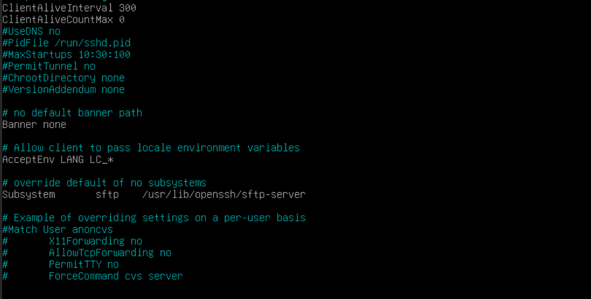

## Guide d’installation et configuration – Lynis, KnightCastle, HardenSysvol

## Sommaire

1. [Installation et configuration de l'outil **Lynis**](#lynis)

2. [Installation et configuration de l'outil **KnightCastle**](#knight)

3. [Installation et configuration de l'outil **HardenSysvol**](#harden)


## 1 - Installation et configuration de l'outil **Lynis**
<span id="lynis"/><span> 

Lynis est un utilitaire en ligne de commande qui va permettre d'analyser la configuration d'une machine Linux (ici nous allons l'utiliser sur un serveur Débian hébergeant notre service mail). Cela va nous permettre d'avoir un apercu de la sécurité de notre serveur. 

Pour l'installer il suffit de taper ceci :
```bash
sudo apt-get update 
sudo apt-get install lynis -y
```

Pour être sur que l'utilitaire est sur notre machine, nous pouvons vérifier en tapant : 
```bash
lynis update info
```


Maintenant nous allons utiliser Lydis pour faire un audit de notre système pour voir ce qui est bien configurer et ce qui peut être amélioé : 
```bash
sudo lynis audit system
```

Au premier audit nous avons un score de **63**. Plus le score est haut et mieux la machine est sécurisée. 


Lydis nous a pointer que SSHD n'est pas sécurisé (en effet, tout est par défaut). Nous allons modifier le fichier comme suit :
```bash
nano /etc/ssh/sshd_config
```




Puis nous allons relancer le service sshd
```bash
systemctl restart sshd
```

Maintenant quand nous refaisons un audit, notre score a augmenté !


