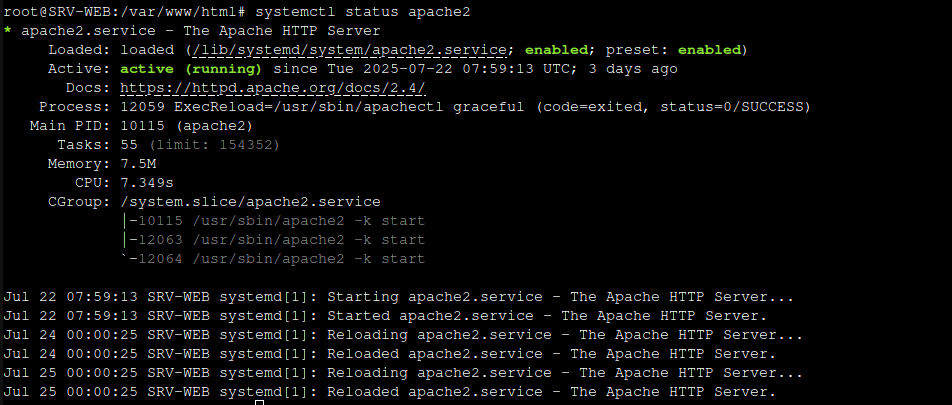

## Installation serveur web 

Nous allons avoir besoin d'une nouvelle machine pour notre serveur web. Ici nous allons créer un container et installer Debian dessus. 
Une fois créer nous allons nous assurer qu'elle fait bien partie du réseau avec la commande 
```bash
ip a
```


Mettre à jour la Debian avec :
```bash
sudo apt update && sudo apt upgrade -y
```
Puis installer **apache2** :
```bash
apt install apache2 -y
```
Pour être sur que **apache2** est bien installé : 
```bash
systemctl status apache2
```


Nous avons à présent une page web fonctionnel. Pour y accéder il suffit d'aller sur une machine ayant une interface graphique connecter à notre réseau (ici nous allons utiliser une machine Windows). Puis de taper dans la barre de recherche d'un navigateur web l'adresse ip de notre serveur web. 

