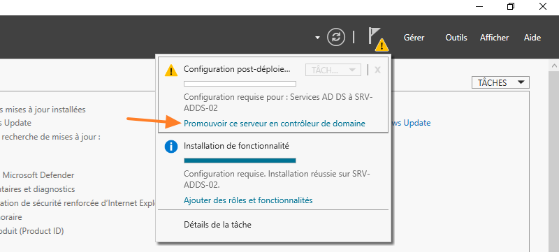
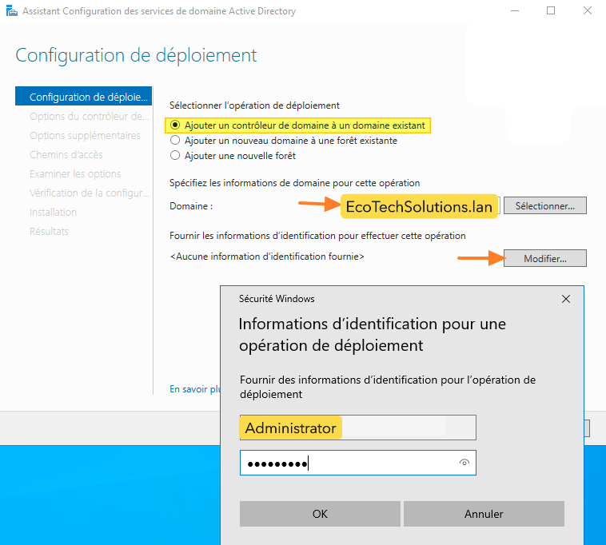
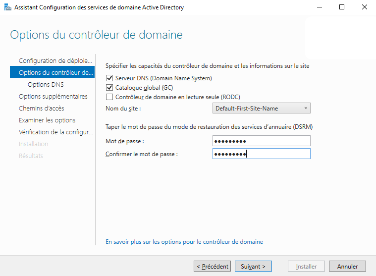
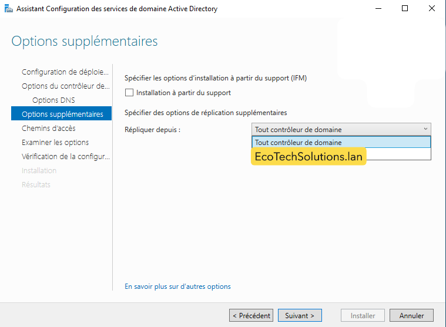
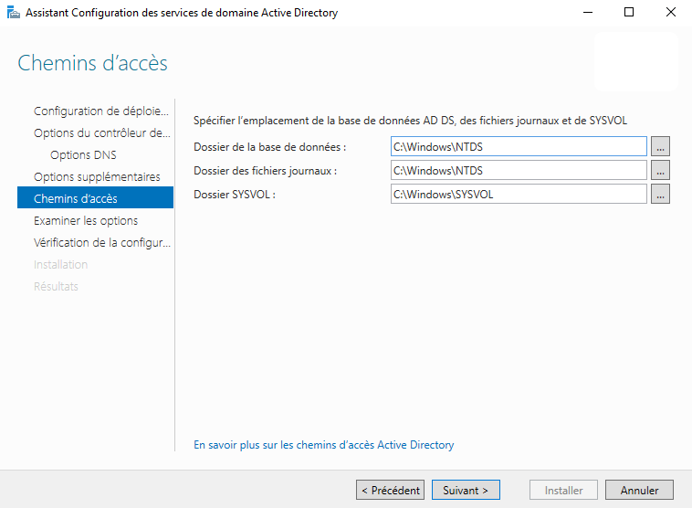
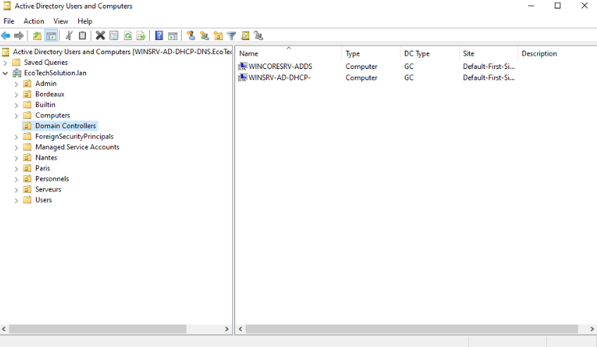
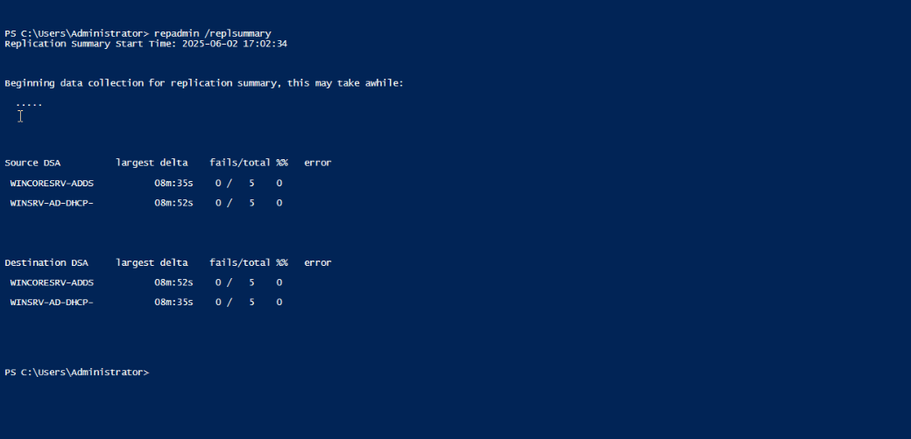

## Guide d’installation et configuration – Serveurs et clients - Ecotech Solutions

## Sommaire

1. [Installation des rôles ADDS, DHCP, DNS – SERVEUR "WINSRV-ADDS-DHCP-DNS"](#installation-des-rôles-adds-dhcp-dns--winsrv-adds-dhcp-dns)
   - [Partie 1 – Installation des rôles](#partie-1--installation-des-rôles)
   - [Partie 2 – Installation du DC Active Directory (ADDS)](#partie-2--installation-du-dc-active-directory-adds)
   - [Partie 3 – Configuration du DHCP](#partie-3--configuration-du-dhcp)
   - [Partie 4 – Configuration du DNS](#partie-4--configuration-du-dns)
   - [Partie 5 – Réplication complète](#partie-5--réplication-complète)
   - [Partie 6 – Création des unités organisationnelles et des GPO](#partie-6--création-des-unités-organisationnelles-et-des-gpo)
2. [Installation de Windows Server Core – "SERVEUR WINCORESRV-ADDS"](#installation-de-windows-server-core--wincoresrv-adds)
   - [Partie 1 – Installation de Windows Server Core – WINCORESRV-ADDS](#installation_windows_server_core)
   - [Partie 2 – Rejoindre le domaine EcoTechSolution](#rejoindre-le-domaine-ecotechsolution)
3. [Installation de Debian avec GLPI – SERVEUR "DEBSRV-GLPI"](#installation-de-debian-avec-glpi--debsrv-glpi)
4. [Installation d’un poste client d'administration Ubuntu – CLIENT "DT-DSI-Admin"](#installation-dun-client-ubuntu--dt-dsi-admin)


### Installation et configuration des rôles ADDS, DHCP et DNS
<span id="installation-des-rôles-adds-dhcp-dns--winsrv-adds-dhcp-dns"></span>   

#### Serveur : WINSRV-AD-DHCP-DNS  
#### Forêt : ecotechsolutions.lan
#### IP Statique : 172.16.40.1
#### Masque Réseau : 255.255.0.0
#### Passerelle : 172.16.255.254
---

### PARTIE 1 – Installation des rôles  
<span id="partie-1--installation-des-rôles"></span>  

#### Étape 1 : Ouvrir le Gestionnaire de serveur
- Lancer "Gestionnaire de serveur"
- Cliquer sur "Ajouter des rôles et fonctionnalités"

#### Étape 2 : Assistant d’ajout de rôles
- Type d'installation : Installation basée sur un rôle ou une fonctionnalité


- Sélection du serveur : WINSRV-AD-DHCP-DNS


#### Étape 3 : Sélection des rôles
Cocher les rôles suivants :
- Services de domaine Active Directory (ADDS)
- Serveur DHCP
- Serveur DNS  
Valider les fonctionnalités supplémentaires si demandé.


#### Étape 4 : Confirmation
- Lancer l'installation
- L'installateur doit indiqué "Installation succeeded". Les rôles correcetement installés sont visibles en vert dans le server manager.


---

## PARTIE 2 – Installation du DC Active Directory (ADDS)  
<span id="partie-2--installation-du-dc-active-directory-adds"></span>

#### Étape 1 : Promouvoir le serveur en contrôleur de domaine
- Après l'installation, cliquer sur l'alerte "Promouvoir ce serveur en contrôleur de domaine"


#### Étape 2 : Configuration du déploiement
- Choisir "Ajouter une nouvelle forêt"
- Nom du domaine racine : ecotechsolutions.lan


#### Étape 3 : Options du contrôleur de domaine
- Niveau fonctionnel de forêt/domaine : Windows Server 2016 ou 2022
- Cochez :
  - Serveur DNS
  - Catalogue global
- Définir un mot de passe DSRM (récupération d'urgence)

#### Étape 4 : Configuration DNS
- Laisser les options par défaut
- Ignorer les avertissements sur la délégation si présents

#### Étape 5 : Nom NetBIOS 
- Nom généré automatiquement : ECOTECHSOLUTIONS

#### Étape 6 : Chemins des bases AD
Laisser les chemins par défaut :
- Base de données : C:\Windows\NTDS
- Fichiers journaux : C:\Windows\NTDS
- SYSVOL : C:\Windows\SYSVOL

#### Étape 7 : Vérification & Installation
- Vérifier le résumé
- Laisser l’analyse de prérequis se terminer
- Cliquer sur "Installer"


- Le serveur redémarrera automatiquement

...

### Partie 3 – Configuration du DHCP  
<span id="partie-3--configuration-du-dhcp"></span>  

### Ajouter un nouveau Scope DHCP

1. Ouvrir la console **DHCP** (`dhcpmgmt.msc`) ou **Server Manager** > **Tools** > **DHCP**
2. Clic droit sur **IPv4** > **New Scope**
3. Assistant **New Scope Wizard** :
   - **Name** : Donner un nom explicite (ex. : "R&D", "Salle de réunion", etc.)
   - **Description** : Par exemple, scope pour tel service etc
   - **IP Address Range** :
     - Start IP : `172.16.x.10`  
     - End IP : `172.16.x.200`
     - Subnet Mask : `255.255.255.0`
   - **Add Exclusions** : Ajouter des IP réservées (ex. : serveurs, imprimantes,etc)
   - **Lease Duration** : 21 jours (modifiable)
   - **Configure DHCP Options now** : Yes
     - Router (Default Gateway) : `172.16.x.254` (la passerelle de l'ADDS)
     - DNS Servers : `172.16.20.3` (Le server ADDS)
     - DNS Domain Name : `ecotechsolution.lan` (Notre nom de domaine)
   - Finir l'assistant
   - Le scope est bien crée

### Serveur DHCP : `winsrv-ad-dhcp-dns.ecotechsolution.lan`
Le rôle **DHCP** est installé sur le serveur principal, qui possède l'**IP statique : `172.16.20.3`**.

### Plages d'adresses (Scopes)

Chaque service de l’entreprise dispose de sa propre plage d’adresses IP grâce à une configuration multi-scopes :

| Scope             | Plage        | Service                                 |
|-------------------|--------------|-----------------------------------------|
| 172.16.20.0/24    | 172.16.20.1 – 172.16.20.254     | Serveurs                                |
| 172.16.50.0/24    | 172.16.50.1 – 172.16.50.254      | Communication                           |
| 172.16.60.0/24    | 172.16.60.1 – 172.16.60.254      | Développement                           |
| 172.16.70.0/24    | 172.16.70.1 – 172.16.70.254      | Direction                               |
| 172.16.80.0/24    | 172.16.80.1 – 172.16.80.254      | Ressources Humaines                     |
| 172.16.90.0/24    | 172.16.90.1 – 172.16.90.254      | Direction des Services d'Information    |
| 172.16.100.0/24   | 172.16.100.1 – 172.16.100.254      | Finance et Comptabilité                 |
| 172.16.110.0/24   | 172.16.110.1 – 172.16.110.254      | Commercial                              |
| 172.16.120.0/24   | 172.16.120.1 – 172.16.120.254      | Extérieur (visiteurs, partenaires, etc.)|

### Paramètres DHCP communs

- **Masque de sous-réseau :** `255.255.255.0`
- **Passerelle par défaut :** `172.16.20.254`
- **Serveur DNS :** `172.16.20.3` (serveur local AD/DNS)
- **Durée du bail :** `21 jours`

...

### Partie 4 – Configuration du DNS  
<span id="partie-4--configuration-du-dns"></span> 

### Ajouter un nouvel enregistrement DNS (Host A)

1. Ouvrir la console **DNS** (`dnsmgmt.msc`) ou **Server Manager** > **Tools** > **DNS**
2. Cliquer sur **Forward Lookup Zones** dans la zone EcoTechSolution.lan
3. Clic droit sur la zone > **New Host (A or AAAA)**
4. Remplir les champs :
   - **Name** : Nom de la machine
   - **IP address** : Adresse IP de la machine
   - Cocher si besoin : *Create associated PTR record* (pour reverse lookup) pour créer automatiquement la résolution inversée.
5. Cliquer sur **Add Host**
6. Une confirmation s'affiche, cliquer sur OK

### Domaine Active Directory : `EcoTechSolution.lan`

Le serveur `WINSRV-AD-DHCP-DNS` assure les rôles :
- **Contrôleur de domaine**
- **Serveur DNS**
- **Serveur DHCP**

### Zones DNS configurées

- `EcoTechSolution.lan` (zone de recherche directe)

### Principaux enregistrements DNS Host A

| Nom                  | Type    | Adresse IP     | Observations                          |
|----------------------|---------|----------------|----------------------------------------|
| (same as parent folder)  | A       | 172.16.20.3    | Serveur DNS principal                  |
| (same as parent folder)  | A       | 172.16.20.5    | Serveur secondaire (ADDS)(wincore)     |
| DT-DSI-Admin         | A       | 172.16.20.7    | Poste Admin DSI                        |
| WINCORESRV-ADDS      | A       | 172.16.20.5    | Serveur membre, rôle ADDS              |
| winsrv-ad-dhcp-dns   | A       | 172.16.20.3    | Serveur principal (AD, DNS, DHCP)      |
| (same as parent folder) | SOA     | winsrv-ad-dhcp-dns | Serveur d'autorité (SOA)         |


---

## Résultat attendu
Le serveur WINSRV-AD-DHCP-DNS devient :
- Contrôleur de domaine pour la forêt ecotechsolutions.lan
- Serveur DNS intégré
- Serveur DHCP prêt à être configuré

### Partie 5 - Réplication complète

### Partie 6 - Création des GPO unités organisationnelles et des GPO
#### Objectif : Créer une hierarchie d'unité organisationnelle correspondant à la structure de l'entreprise afin d'appliquer des stratégies de gestion, sécuritaire selon les utilisateurs et les machines.

#### Etape 1 : Création des UO
- Ouvrir Active Directory Users & Computers sur notre serveur Windows ADDS

- Notre domaine `EcoTechSolution.lan` existe déjà. Clique droit sur celui-ci > **New** > **Organizational Unit**  


---

- On peut ensuite créer les OU que nous souhaitons en indiquant le nom, cliquer ensuite sur **OK** pour valider.

- Selon le service une arborescence d'OU fini par apparaitre comme sur la photo ci-dessous. Par exemple, Site > Services > Sous-services > Salarié

---


####  _Astuce : Activer **l’option "Protéger contre la suppression accidentelle"** lors de la création des OU._

---

#### Etape 2 : Création des GPO

Ouvrir la **console "Gestion de la stratégie de groupe"** (`gpmc.msc`).

##### 🔒 GPO : Verrouillage de session

- Nom : `Verrouillage_de_compte`
- Chemin : `Computer Configuration > Windows Settings > Security Settings > Account Policies > Account Lockout Policy`
- Configuration :
  - `Inactivité avant verrouillage de la session` : **600 secondes (10 minutes)**
- Lier à : `EcoTechSolution.lan`


---

##### 🔑 GPO : Complexité du mot de passe

- Nom : `Password_Policy`
- Chemin : `Configuration ordinateur > Paramètres Windows > Paramètres de sécurité > Stratégies de compte > Stratégie de mot de passe`
- Configuration :
  - Longueur minimale : **12 caractères**
  - Complexité : **Activée**
  - Durée de vie : **42 jours**
- Lier à : `EcoTechSolution.lan`


---

##### GPO : Screensaver with password

- Nom : `Password_après_veille`
- Chemin : `User Configuration > Administrative Templates > Control Panel > Personalization`
- Configuration :
  - Enabled
- Lier à : `EcoTechSolution.lan`

---

##### GPO : Control pannel access
Nous avons fait le choix d'interdir avec un GPO l'acces au panneau de configuration à tout les membres de l'Active Directory et créer par derrière un GPO qui lui donne accès uniquement pour les admins/membre de l'OU DSI. Le même fonctionnement est utilisé pour les logs.

- Nom : `Control_panel_users_NO`ou `Control_panel_admin_YES`
- Chemin : `User Configuration > Administrative Templates > Control Panel > Prohibit access to Control Panel`
- Configuration :
  - "Enabled" pour l'OU users
  - "Disabled" pour l'OU admin/DSI
- Lier l'interdiction à : `EcoTechSolution.lan` et l'autorisation à l'OU DSI/Admin


---

##### GPO : Restriction d'accès aux logs
- Nom : `Logs_access_users_NO` ou `Logs_access_admin_YES`
- Chemin : `Configuration ordinateur > Paramètres Windows > Paramètres de sécurité > Stratégies de compte > Stratégie de mot de passe`
- Configuration :
  - "Enabled" pour l'OU users
  - "Disabled" pour l'OU admin/DSI
- Lier l'interdiction à : `EcoTechSolution.lan` et l'autorisation à l'OU DSI/Admin

---

##### GPO : Fond d’écran imposé
- Nom : `Wallpaper`
- Chemin : `Configuration utilisateur > Stratégies > Modèles d’administration > Bureau > Active Desktop`
- Paramètre : **Image d’arrière-plan Active Desktop** : `\\WINSRV-AD-DHCP-DNS.EcoTechSolution.lan\DOCS\Wallpaper\Wallpaper_Windows_XP.JPG`
- Lier à : `EcoTechSolution.lan`
> ⚠️ Le fichier `wallpaper.jpg` doit être disponible via un partage réseau accessible à tous.


---

#### Étape 3 – Application des GPO

- Forcer l’application via la commande :
_powershell_
`gpupdate /force`

---

### Installation de Windows Server Core – "SERVEUR WINCORESRV-ADDS  
<span id="installation-de-windows-server-core--wincoresrv-adds"></span>  

## Partie 1 - Installation de Windows Server Core – WINCORESRV-ADDS  
<span id="installation_windows_server_core"></span> 
  
## 1° | Installation et configuration de notre Windows Serveur 2022 core :
-------------------------------
## - Configuration initiale du serveur core -
##### **Changer le nom du serveur :** 
- Aller dans **Computer name** et suivre les menus pour modifier le nom du serveur. Dans notre cas nous l'avons nommer selon notre convention de nommage soit => ``WINCORESRV-ADDS``

##### **Configuration Réseau du serveur core :**
- Allez dans **Network settings** puis suivre les menus pour modifier l'adresse IP de la carte réseau ainsi que l'adresse IP du DNS. Ou bien on peut aussi effectuer la configuration en Powershell avec les commandes suivantes :
**NB : Les adresses sont à adapter à votre réseau**
```
1 New-NetIPAddress -IPAddress "172.16.10.20" -PrefixLength "24" -InterfaceIndex (Get-NetAdapter).ifIndex
2 Set-DnsClientServerAddress -InterfaceIndex (Get-NetAdapter).ifIndex -ServerAddresses ("127.0.0.1")
```
- Vérifier votre configuration avec la commande ``Get-NetIPAdress`` permettant d'afficher les détails de votre interface réseau.

## 2° | Installation des rôles :
-------------------
##### **Fonctionnalités nécéssaire en tant que controleur de domaine :**
Nous avons besoin de ces différents outils :
- **RSAT-AD-Tools**
- **AD-Domain-Services**
- **DNS**

Pour cela, executer successivement ces 3 lignes de commandes PowerShell : 
```
1 Add-WindowsFeature -Name "RSAT-AD-Tools" -IncludeManagementTools -IncludeAllSubFeature
2 Add-WindowsFeature -Name "AD-Domain-Services" -IncludeManagementTools -IncludeAllSubFeature
3 Add-WindowsFeature -Name "DNS" -IncludeManagementTools -IncludeAllSubFeature
```

## Partie 2 - Rejoindre le domaine EcoTechSolution  
<span id="rejoindre-le-domaine-ecotechsolution"></span>  
  
 #### Étape 1 :   
 - Dans le menu principal, sélectionner PowerShell avec l’option 15  
  
  
#### Étape 2 :  
- Entrer la commande suivante :  
> Add-Computer -DomainName "EcoTechSolution.lan" -Credential "EcoTechSolution\Administrator" -Restart
  

  
#### Étape 3 :  
- Une fenêtre s’ouvre, vous invitant à entrer le mot de passe. Entrer le mot de passe : Azerty1*  
Après cela, la machine va redémarrer.  

  
#### Étape 4 :  
- Une fois redémarrer, vous pouvez observer sur la ligne Domain/workgroup, que vous êtes passez de « Workgroup » à « EcoTechSolution.lan ». Cela signifie que votre machine à bien été ajouté au  domain.  

  
#### Étape 5 :  
- Redémarrer la machine, lors du déverrouillage du clavier, appuyer 2 fois sur la touche ESC (echap) pour changer de compte.  

  
#### Étape 6 :  
- Sélectionner « Other user »  

  
#### Étape 7 :  
- Dans « User name » entrer : ECOTECHSOLUTION\Administrator  
Ensuite, appuyer sur la touche « Tabulation » pour passer sur la ligne du mot de passe (Password) et entrer le mot de passe : Azerty1* , puis Entrée.  

  
#### Étape 8 :  
- Une fois dans le menu, sélectionner l’option 15 (PowerShell)  

  
#### Étape 9 :  
- Vérifier que vous êtes bien connecté au compte Administrator du domain avec la commande : whoami  

  
#### Étape 10 :  
- Vérification que le serveur apparaît bien comme membre du domaine dans la console Active Directory :  
  Dans la barre de recherche du menu démarrer, taper : dsa.msc, une fenêtre (Active Directory Users and Computers) s’ouvre  

  
#### Étape 11 :  
- Dans l’arborescence du domaine (EcoTechSolution), dérouler le menu  

  
#### Étape 12 :  
- Cliquer sur « Computer », vous verrez apparaître dans la fenêtre centrale la machine server core  


### Partie 5 – Réplication complète
<span id="partie-5--Réplication-complète"></span> 

-------------------

>Nos deux serveur Windows GUI et Core ont tout deux une **réplication intrasite** pour permettre lors d'une modification effectuer qu'elle soit automatiquement réaliser sur le/les autres DC du domaine.
>
>Pour ce faire il existe différents moyens, l'une d'entre elle serai depuis l'installation du **rôle ADDS**. Si vous avez déjà votre serveur en tant que contrôleur de domaine sur un ActiveDirectory déjà en place, il vous >suffit lors de l'installation du rôles sur votre nouveau serveur de lui attribuer le domaine déjà existant lors de la promotion de votre nouveau serveur en contrôleur de domaine.

A) - Installer le rôle ADDS puis cliquer sur **Promouvoir ce serveur en contrôleur de domaine**.



B) - Configurer le déploiement en sélectionnant **Ajouter un contrôleur de domaine à un domaine existant** et spécifiez le nom du domaine, ici **EcoTechSolutions.lan**.

**NB** : Les permissions administrateurs sont nécessaires pour réaliser cette opération via le bouton **Modifier**.



C) - A l'étape suivante :
- Cochez **Serveur DNS** afin qu'il soit aussi serveur DNS, ce qui permettra de redonder ce service au niveau de l'infrastructure
- Cochez **Catalogue global (GC)** afin d'avoir deux catalogues globaux
- Ne cochez pas **Contrôleur de domaine en lecture seule**, car nous avons besoin d'un DC en lecture et écriture
- **Laissez le nom du site par défaut**, sauf si votre infrastructure se situe sur plusieurs sites et que vous avez déjà fait la déclaration de vos sites AD
- **Indiquez un mot de passe complexe** pour la restauration des services d'annuaire (qui n'a rien à voir avec le mot de passe pour se connecter au serveur)



D) - Passez l'étape **DNS** pour arriver aux **options supplémentaires**, ici vous pouvez spécifier d'utiliser un DC spécifique pour la réplication. Dans notre situation nous en avons qu'un seul donc on peut laisser par défaut sur **Tout contrôleur de domaine** sinon choisissez votre nom de domaine.



E) - Conservez les chemins par défaut et faite **Suivant**



F) - Attendez l'étape de vérifications. Si tout est OK, cliquer sur **installer**.
Une fois l'opération effectuer le serveur **redémarre automatiquement**

G) - Vérifier l'opération soit directement en GUI : Dans l'onglet **Active Directory Users and Computers** sous **Domain Controllers**, vous devriez voir vos différents serveurs affiliés.



- Soit en ligne de commande PowerShell (indispensable pour vérifier sur le server Core) avec :
``Get-ADDomainController -Identity <NomDuServeur>``

- Vous pouvez aussi utiliser les commandes de diagnostics => 
``repadmin /showrepl *``
``repadmin /replsummary``

Ces commandes donne des détails sur la réplication entre les contrôleurs de domaine : s'il y a une erreur de réplication, elle apparaîtra ici.


## Installation de Debian avec GLPI – DEBSRV-GLPI  
<span id="installation-de-debian-avec-glpi--debsrv-glpi"></span>  

...

## Installation d’un client Ubuntu – DT-DSI-Admin  
<span id="installation-dun-client-ubuntu--dt-dsi-admin"></span>  

### Trippy

Pour installer Trippy sur Ubuntu, il suffit de taper ceci en ligne de commande :

```bash
sudo add-apt-repository ppa:fujiapple/trippy
sudo apt update && sudo apt install trippy
```


### WireShark

Pour installer Wireshark sur Ubuntu il suffit de taper cette commande sur le terminal :

```bash
sudo apt install wireshark
```
    
### Cockpit

Pour fonctionner, Cockpit doit être installer sur toutes les machines (Linux uniquement) que l'on souhaite administrer. 
    
```bash 
sudo apt-get update
sudo apt install -t <codename de la version de l'OS>-backports cockpit
```

Une fois installer nous allons activer le démarrage automatique de Cockpit : 

```bash
sudo systemctl enable cockpit.socket
```

Pour vérifier que le service Cockpit est actif, vous pouvez utiliser la commande suivante :

```bash
systemctl status cockpit
```


    
### NetData

Pour ce logiciel, nous avons besoin d'installer le service **NetData Agent** sur toutes les machines que l'ont souhaitent monitorer. 

#### Installation du 1er Node

Pour commencer, vous devez crée un compte et vous connecter sur le site : 

```
https://www.netdata.cloud
```

Vous arriverez sur votre espace de monitoring ("Space" dans NetData)


Pour ajouter un machine ("Node" dans NetData) cliquez au centre de la fenêtre sur le bouton "Connect a node to start" pour ouvrir la fenêtre d'ajout d'un "Node".


Suivez les instructions de cette fenêtre en fonction de l'OS de la machine que vous voulez monitorer pour installer le service **NetData Agent**.

Un fois l'Agent installer, votre "Space" devrais s'actualiser automatiquement, sinon actualiser vous même votre navigateur web.


#### Installation de Node supplémentaire

Pour ajouter un nouveau "Node" à votre "Space", cliquez sur l'icone d'hexagone "+" et suivez les instructions de cette fenêtre en fonction de l'OS de la machine que vous voulez ajoutez.


Ou cliquez sur le bouton "Live" en haut à droite, pour ouvrir la fenêtre d'affichage de tous les "Nodes", puis cliquez sur le bouton "Add Nodes". Suivez les instructions de cette fenêtre en fonction de l'OS de la machine que vous voulez ajoutez.


Répétez cette opération à chaque fois que vous voulez ajouter un nouveau Node à votre Space.
